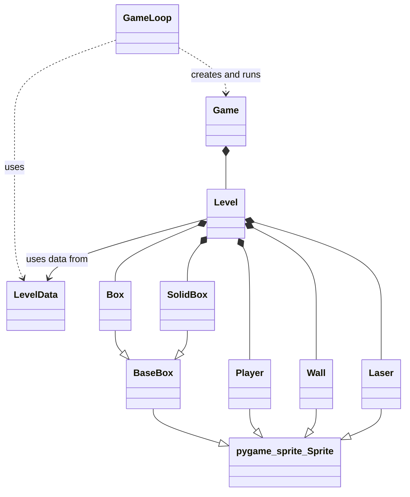
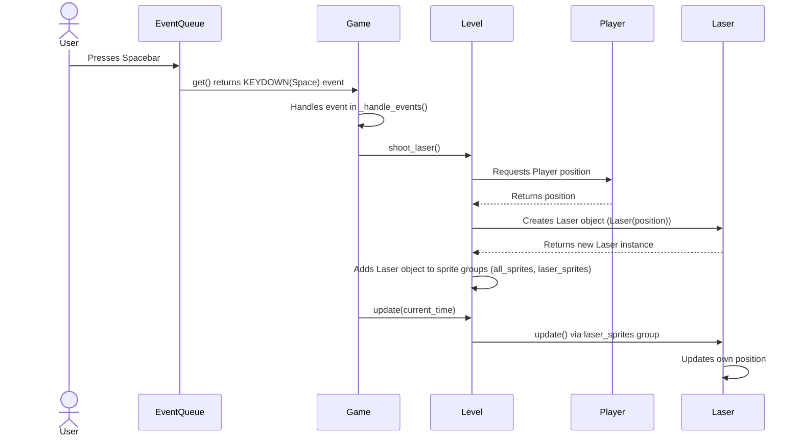

# Arkkitehtuurikuvaus

## Rakenne

Sovelluksen lähdekoodi sijaitsee `src`-hakemistossa ja on jaettu seuraaviin päämoduuleihin ja tiedostoihin:

* **`src/`**: Projektin juurihakemisto lähdekoodille.
    * **`level/`**: Sisältää moduulit, jotka liittyvät pelikentän tilaan ja tason datan lataamiseen.
        * `level.py`: Määrittelee `Level`-luokan, joka hallinnoi pelikentän elementtejä ja niiden päivitystä. `Level` sisältää instansseja `sprites/`-hakemistossa määritellyistä sprite-luokista.
        * `level_data.py`: Määrittelee `LevelData`-luokan, joka vastaa pelikenttien konfiguraatiodatan tarjoamisesta.
    * **`sprites/`**: Sisältää moduulit, jotka määrittelevät eri sprite-tyypit.
        * `box.py`: Määrittelee `BaseBox`, `Box` ja `SolidBox` luokat.
        * `laser.py`: Määrittelee `Laser`-luokan.
        * `player.py`: Määrittelee `Player`-luokan.
        * `wall.py`: Määrittelee `Wall`-luokan.
    * **`ui/`**: Sisältää moduulit, jotka liittyvät käyttöliittymään, pelin suorittamiseen ja renderöintiin.
        * `game_loop.py`: Määrittelee `GameLoop`-luokan, joka hallitsee pelikierrosten käynnistämisen ja hallinnan.
        * `game.py`: Määrittelee `Game`-luokan, joka vastaa yksittäisen pelikierroksen pääsilmukan suorittamisesta.
        * `renderer.py`: Määrittelee `Renderer`-luokan, joka vastaa pelitilan piirtämisestä näytölle.
    * **`clock.py`**: Määrittelee `Clock`-luokan, joka tarjoaa rajapinnan Pygamen ajan hallintaan.
    * **`event_queue.py`**: Määrittelee `EventQueue`-luokan, joka tarjoaa rajapinnan Pygamen tapahtumajonoon.
    * **`main.py`**: Sovelluksen pääsuoritustiedosto, joka alustaa ja käynnistää `GameLoopin`.
    * **`settings.py`**: Sisältää globaalit konfiguraatioasetukset.

## Sovelluslogiikka

Sovelluksen logiikka perustuu useamman luokan yhteistyöhön. Ylimmällä tasolla `GameLoop` hallitsee pelikierrosten elinkaarta. Yksi `Game`-instanssi edustaa yhtä pelikierrosta. `Game`-instanssi puolestaan on riippuvainen muista komponenteista pelin pyörittämiseen: `Level`, `Renderer`, `Clock` ja `EventQueue`.

Tason data ladataan `LevelData`-luokan avulla, ja tämä data syötetään `Level`-luokalle sen alustamisvaiheessa. `Level`-luokka sisältää pelielementit (`Player`, `Box`, `SolidBox`, `Wall`, `Laser`), jotka on toteutettu perimällä `pygame.sprite.Sprite`-luokasta. `Box` ja `SolidBox` perivät yhteisestä kantaluokasta `BaseBox`, joka itse perii `pygame.sprite.Sprite`:stä.

## Päätoiminnallisuudet

### Laserin ampuminen

Kun käyttäjä painaa välilyöntiä, `Game`-luokka tunnistaa tapahtuman ja käskee `Level`-luokkaa ampumaan laserin.
`Level` pyytää pelaajan sijaintia, luo uuden `Laser`-olion kyseiseen paikkaan ja lisää sen pelin sprite-ryhmiin.
Tämän jälkeen `Laser`-olio liikkuu automaattisesti ylöspäin pelin päivityssilmukassa, kunnes se poistuu näytöltä.

