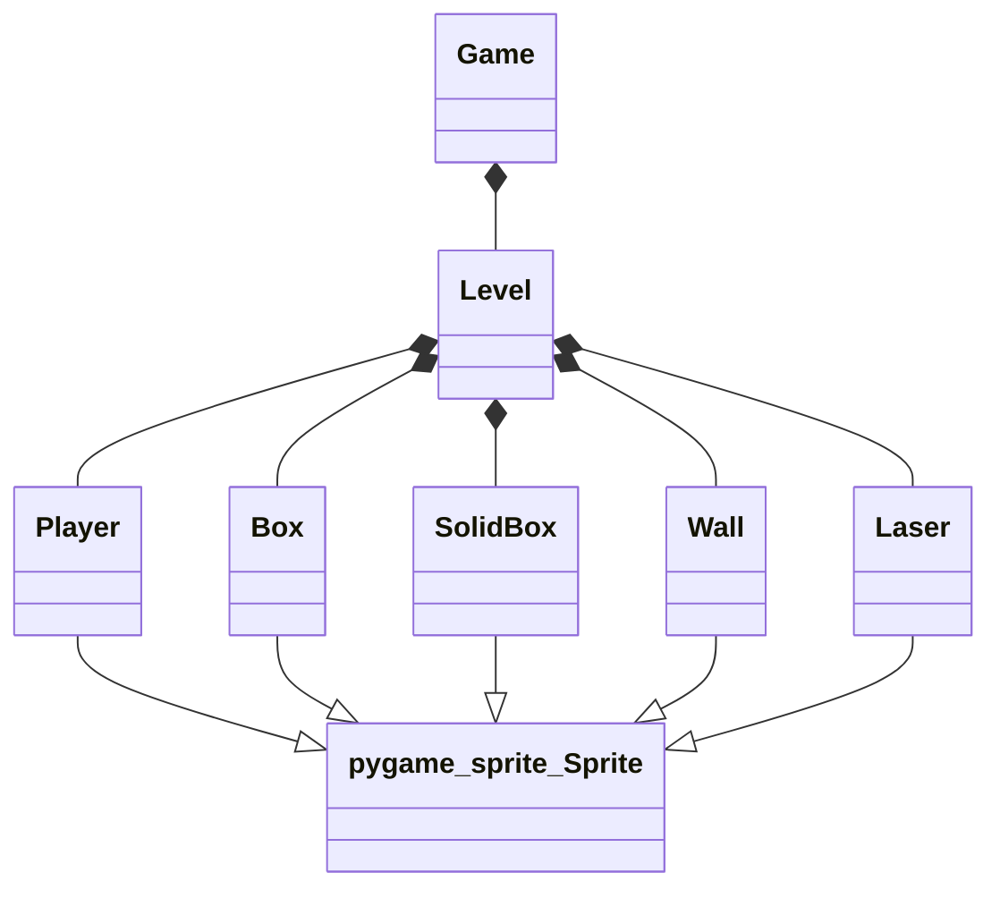
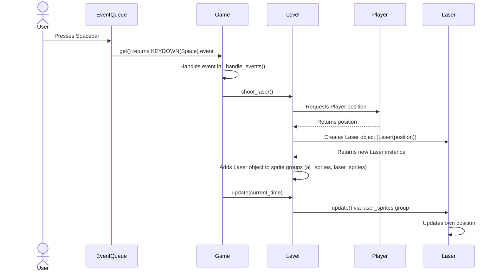

## Sovelluslogiikka

```mermaid
classDiagram
    class Game
    class Level
    class Player
    class Box
    class SolidBox
    class Wall
    class Laser
    class pygame_sprite_Sprite

    Game *-- Level  
    Level *-- Player 
    Level *-- Box
    Level *-- SolidBox
    Level *-- Wall
    Level *-- Laser

    Player --|> pygame_sprite_Sprite
    Box --|> pygame_sprite_Sprite
    SolidBox --|> pygame_sprite_Sprite
    Wall --|> pygame_sprite_Sprite
    Laser --|> pygame_sprite_Sprite
```
## Päätoiminnallisuudet

### Laserin ampuminen

```mermaid
sequenceDiagram
    actor User
    participant EventQueue
    participant Game
    participant Level
    participant Player
    participant Laser

    User->>EventQueue: Presses Spacebar

    EventQueue->>Game: get() returns KEYDOWN(Space) event
    Game->>Game: Handles event in _handle_events()
    Game->>Level: shoot_laser()
    Level->>Player: Requests Player position
    Player-->>Level: Returns position
    Level->>Laser: Creates Laser object (Laser(position))
    Laser-->>Level: Returns new Laser instance
    Level->>Level: Adds Laser object to sprite groups (all_sprites, laser_sprites)

    Game->>Level: update(current_time)
    Level->>Laser: update() via laser_sprites group
    Laser->>Laser: Updates own position
```
