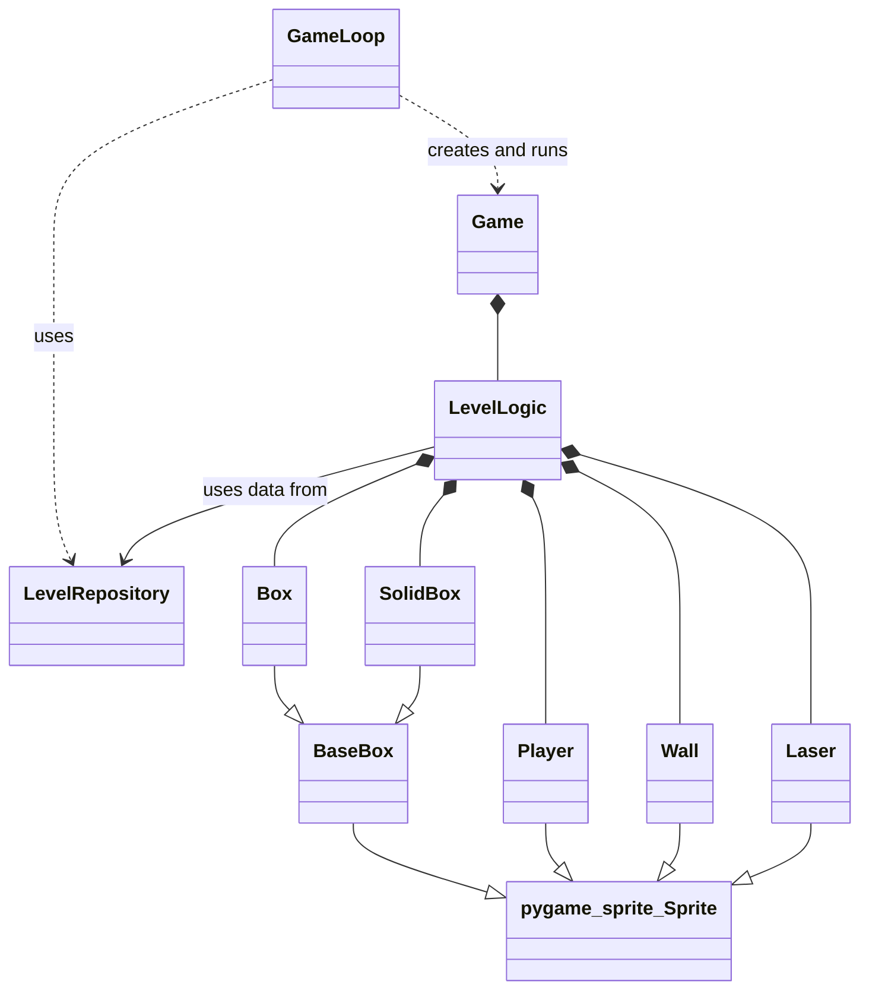
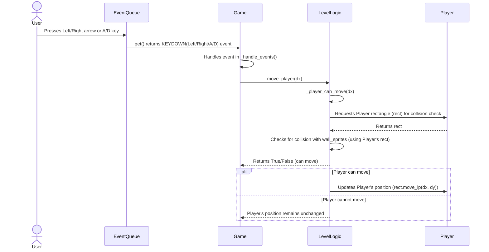
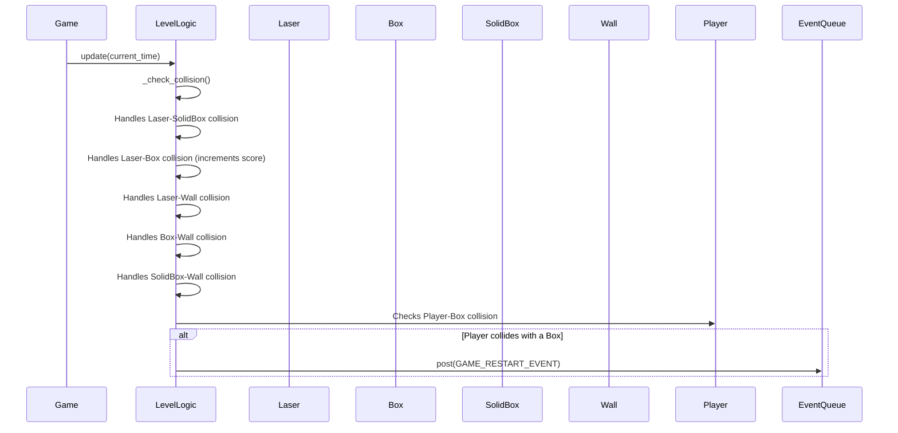

# Arkkitehtuurikuvaus

## Rakenne

Sovelluksen lähdekoodi sijaitsee `src`-hakemistossa ja on jaettu seuraaviin päämoduuleihin ja tiedostoihin:

* **`src/`**: Projektin juurihakemisto lähdekoodille.
    * **`data/`**: Sisältää sovelluksen käyttämän datan.
        * `database.sqlite`: Käytetään pisteiden tallennukseen.
        * `instructions.txt`: Sisältää käyttöohjeet.
        * `levelLogic_data.yaml`: Sisältää pelitasojen rakenteen.
    * **`infra/`**: Sisältää infrastruktuurin apuluokat.
        * `clock.py`: Määrittelee `Clock`-luokan, joka tarjoaa rajapinnan Pygamen ajan hallintaan.
        * `event_queue.py`: Määrittelee `EventQueue`-luokan, joka tarjoaa rajapinnan Pygamen tapahtumajonoon.
    * **`level_logic/`**: Sisältää moduulit, jotka liittyvät pelikentän tilaan ja tason datan lataamiseen.
        * `level_logic.py`: Määrittelee `LevelLogic`-luokan, joka hallinnoi pelikentän elementtejä ja niiden päivitystä. `LevelLogic` sisältää instansseja `sprites/`-hakemistossa määritellyistä sprite-luokista. Sisältää sovelluksen pelin logiikan.
    * **`repositories/`**: Sisältää moduulit, jotka vastaavat tietojen pysyväistallennuksesta ja hakemisesta.
            * `high_scores_repository.py`: Määrittelee luokan, joka vastaa pisteiden tallentamisesta ja noutamisesta.
            * `how_to_play_repository.py`: Määrittelee luokan, joka vastaa peliohjeiden noutamisesta.
            * `level_repository.py`: Määrittelee luokan, joka vastaa pelitasojen tietojen noutamisesta.
    * **`sprites/`**: Sisältää moduulit, jotka määrittelevät eri sprite-tyypit.
        * `box.py`: Määrittelee `BaseBox`, `Box` ja `SolidBox` luokat.
        * `laser.py`: Määrittelee `Laser`-luokan.
        * `player.py`: Määrittelee `Player`-luokan.
        * `wall.py`: Määrittelee `Wall`-luokan.
    * **`ui/`**: Sisältää moduulit, jotka liittyvät käyttöliittymään, ja renderöintiin.
        * **`game/`**: Sisältää pelin suorittamiseen ja renderöintiin liittyvät moduulit.
            * `game_loop.py`: Määrittelee `GameLoop`-luokan, joka hallitsee pelikierrosten käynnistämisen ja hallinnan.
            * `game.py`: Määrittelee `Game`-luokan, joka vastaa yksittäisen pelikierroksen pääsilmukan suorittamisesta. Vastaa käyttäjän antamien syötteiden välittämisestä `LevelLogic`-luokalle. Varsinainen pelinkulun logiikka tapahtuu kuitenkin `LevelLogic`-luokassa.
            * `game_renderer.py`: Määrittelee `GameRenderer`-luokan, joka vastaa pelitilan piirtämisestä näytölle.
        * **`menu/`**: Sisältää moduulit eri valikkonäkymiin.
            * `game_cleared_menu.py`: Määrittelee `GameClearedMenu`-luokan pelin läpäisyyn.
            * `high_scores_menu.py`: Määrittelee `HighScoresMenu`-luokan pisteiden valikon toiminnallisuudelle.
            * `how_to_play_menu.py`: Määrittelee `HowToPlayMenu`-luokan peliohjeiden valikon toiminnallisuudelle.
            * `main_menu.py`: Määrittelee `MainMenu`-luokan päävalikon toiminnallisuudelle.
            * `menu_base.py`: Määrittelee `MenuBase`-luokan muiden valikkojen pohjarakenteeksi.

    * **`database_connection.py`**: Vastaa yhteyden muodostamisesta sovelluksen tietokantaan.
    * **`initialize_database.py` `build.py`**: Vastaa tietokannan alustamisesta.
    * **`main.py`**: Sovelluksen pääsuoritustiedosto, joka alustaa ja käynnistää `GameLoopin`.
    * **`settings.py`**: Sisältää globaalit konfiguraatioasetukset.

## Sovelluslogiikka

Sovelluksen logiikka perustuu useamman luokan yhteistyöhön. Ylimmällä tasolla `GameLoop` hallitsee pelikierrosten elinkaarta. Yksi `Game`-instanssi edustaa yhtä pelikierrosta. `Game`-instanssi puolestaan on riippuvainen muista komponenteista pelin pyörittämiseen: `LevelLogic`, `GameRenderer`, `Clock` ja `EventQueue`.

Tason data ladataan `LevelRepository`-luokan avulla, ja tämä data syötetään `LevelLogic`-luokalle sen alustamisvaiheessa. `LevelLogic`-luokka sisältää pelielementit (`Player`, `Box`, `SolidBox`, `Wall`, `Laser`), jotka on toteutettu perimällä `pygame.sprite.Sprite`-luokasta. `Box` ja `SolidBox` perivät yhteisestä kantaluokasta `BaseBox`, joka itse perii `pygame.sprite.Sprite`:stä.

## Päätoiminnallisuudet

### Laserin ampuminen

Kun käyttäjä painaa välilyöntiä, `Game`-luokka tunnistaa tapahtuman ja käskee `LevelLogic`-luokkaa ampumaan laserin.
`LevelLogic` pyytää pelaajan sijaintia, luo uuden `Laser`-olion kyseiseen paikkaan ja lisää sen pelin sprite-ryhmiin.
Tämän jälkeen `Laser`-olio liikkuu automaattisesti ylöspäin pelin päivityssilmukassa, kunnes se poistuu näytöltä.

### Pelaajan liikkuminen

Kun käyttäjä painaa liikkumisnäppäintä, `Game`-luokka vastaanottaa tapahtuman `EventQueue`-jonosta.
`Game` välittää liikkumiskäskyn `LevelLogic`-luokan `move_player`-metodille. 
Ennen pelaajan sijainnin päivittämistä `LevelLogic` tarkistaa `_player_can_move`-metodillaan, 
onko liikkuminen mahdollista törmäämättä seiniin. 
Mikäli liike on esteetön, pelaajan sijainti päivitetään.

### Törmäysten käsittely

`LevelLogic`-luokan `update`-metodin suorituksen aikana kutsutaan `_check_collision`-metodia, 
joka vastaa kaikista pelin törmäystarkistuksista. 
Tämä metodi hyödyntää Pygamen sprite-ryhmien toimintoja käsitelläkseen törmäyksiä laserien, laatikoiden ja seinien välillä. 
Esimerkiksi laserit ja tavalliset laatikot tuhoutuvat osuessaan toisiinsa ja pisteitä lisätään, 
kun taas törmäys kiinteisiin laatikoihin tai seiniin ainoastaan tuhoaa laserin. 
Jos pelaaja törmää mihinkään laatikkoon peli käynnistyy uudelleen.