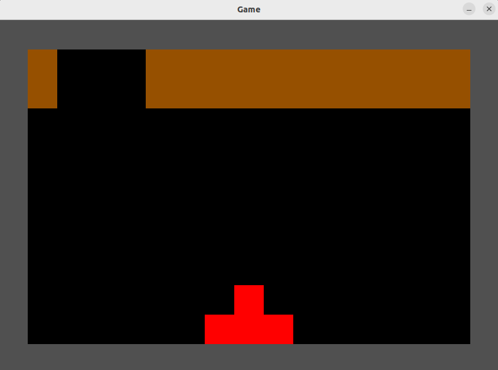
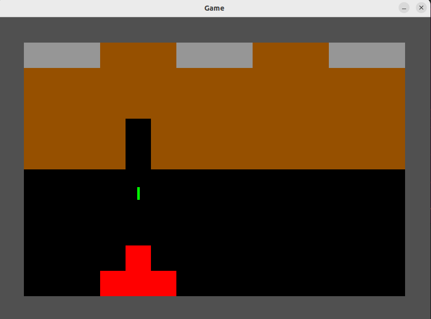
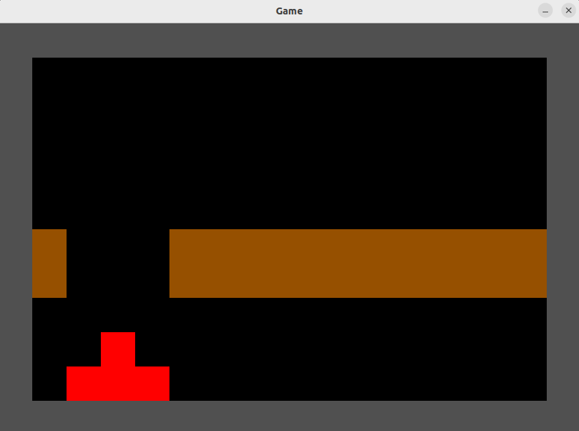

# Pelaaminen

#### Pelissä voi liikkua vasemmalle ja oikealle painamalla nuolinäppäimiä (&larr; &rarr;).

#### Välilyöntiä painamalla pelaaja voi ampua laserin. Laserilla voi tuhota ruskeita laatikoita. Harmaat laatikot ovat tuhoutumattomia.

#### Pelaajan tulee väistää ylhäältä putoavia laatikoita. Peli alkaa alusta jos pelaajaan osuu putoava laatikko.

#### Pelin voi aloittaa alusta painamalla (R).
#### Pelin voi sammuttaa painamalla (Q).